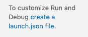

# Running and Debugging

In order to run or debug an ObjectScript class or routine, you must create a launch configuration. Click the run button in the Activity Bar:

If no launch configurations are available, you are prompted to create one:



Clicking the link creates and opens a `launch.json` file containing the following default information:

```js
{
    "version": "0.2.0",
    "configurations": [
        {
            "type": "objectscript",
            "request": "launch",
            "name": "XDebug"
        }
    ]
}
```

These attributes are mandatory for any launch configuration:

- **type** - Identifies the type of debugger to use. In this case, `objectscript`, supplied by the InterSystems ObjectScript extension.
- **request** - Identifies the type of action for this launch configuration. Possible values are `launch` and `attach`.
- **name** - An arbitrary name to identify the configuration. This name appears in the Start Debugging drop down list.

In addition, for an **objectscript** configuration, you need to supply the attribute **program**, which specifies the executable or file to run when launching the debugger, as shown in the following example:

```js
"launch": {
	"version": "0.2.0",
	"configurations": [
      
		{
			"type": "objectscript",
			"request": "launch",
			"name": "ObjectScript Debug HelloWorld",
			"program": "##class(Test.MyClass).HelloWorld()",
		},
		{
			"type": "objectscript",
			"request": "launch",
			"name": "ObjectScript Debug GoodbyWorld",
			"program": "##class(Test.MyOtherClass).GoodbyWorld()",
		},
	]
	}
```

