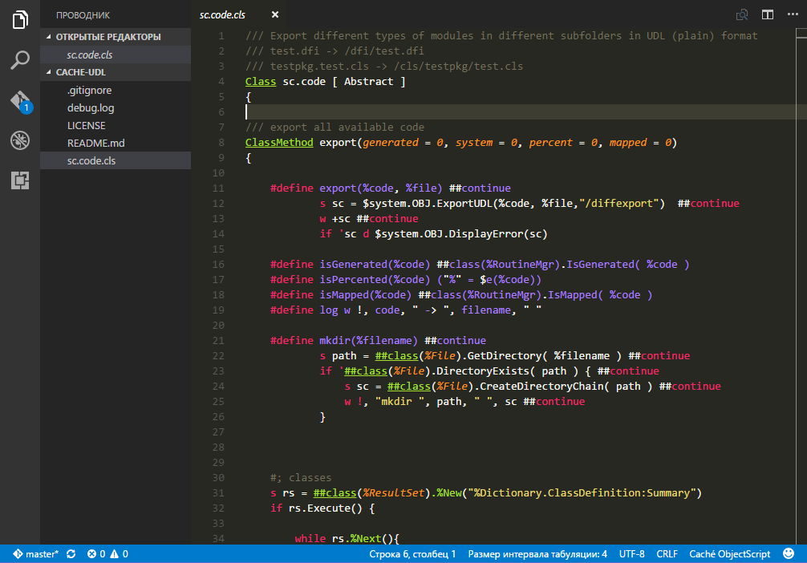

# vscode-cos

Initial [Cache](http://www.intersystems.com/our-products/cache/cache-overview/) ObjectScript ( COS ) language support for Visual Studio Code

Features
--------

Configure connection
--------------------

To be able to use many plugin features, you need to configure the connection to Caché server first.

- Find a 'cos.conn' section in workspace settings (File - Preferences - Settings)
- Change settings according to your Caché instance and reload VSCode ( as temporary solution )
- You will see Caché-related output in "Output" while switched to "cos" channel (right drop-down menu on top of the output window) 

Features
--------

+ Export existing sources to the working directory: press Ctrl+Shift+P, type 'COS', press Enter.
+ Save and compile a class: press Ctrl+F7 or select "COS: Save and compile" from Ctrl+Shift+P menu.

Notes
-----

[Visual Studio Marketplace](https://marketplace.visualstudio.com/items?itemName=doublefint.vscode-cos)

For Caché instance with maximum security level, add '%Development' role for '/api/atelier/' web-application ( [More]( https://community.intersystems.com/post/using-atelier-rest-api) )

Language support based on https://github.com/RustamIbragimov/atom-language-cos

